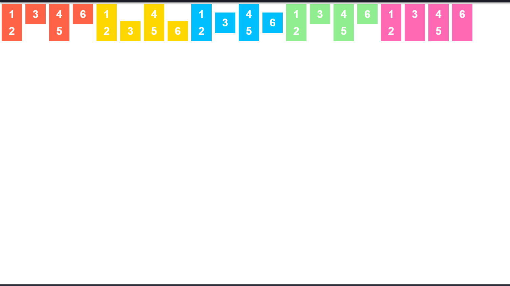

1) Review lại kiến thức cũ 10 phút.
Flex box.
 Demo bằng thằng này:
https://xuanthulab.net/su-dung-flexbox-bo-cuc-trang-trong-css.html
2) Chữa bài tập về nhà. 30 phút, giải đáp thắc mắc cho mọi người.

3) GIới thiệu về các thuộc tính của thẻ a, hover....
   Pseudo-Class cho đường link
   Pseudo-Class được sử dụng nhiều nhất với các đường liên kết (thẻ <a>) để tạo ra hiệu ứng thay đổi trạng thái chữ mỗi khi người dùng di chuột qua nó.

Có tất cả 4 trạng thái tương đương với 4 Pseudo-Class của đường link:

a:link {color:blue;}: Hiển thị hiệu ứng khác biệt để người đọc biết đây là đường liên kết.
a:visited {color:green;}: Đường link đã từng được click vào.
a:hover {color:red;}: Di chuột qua đường link.
a:active {color:navy;}: Đường link đang được nhấp chuột vào.
=> demo

4)Giao bài tập trong giờ .
Làm cho chú bài này.

5)CHo bài tập về nhà gửi qua mail