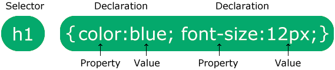

# Kiểm tra bài cũ về table (10 phút)
# Ôn lại bài cũ (5 phút)
# Dạy về CSS :
    - Tại sao lại cần css
    - Cú pháp:

    - Có 3 loại css : inline, external, internal
https://www.w3schools.com/css/css_howto.asp
    - Các cháu đã được học các thẻ nào, một vài css với các thẻ đó.
# Dạy về css thì sẽ có selector:
    - id
    - Class
    - tag
# Cụ thể css: 
    1. Color:
        - Background-color
        - Color
        - Border-color
Thực hành :
- css màu sắc cho thẻ p, thẻ h1, h2 (đặt id, đặt class)
- Thử bật developer tool để css trực tiếp cho phần tử html
- 