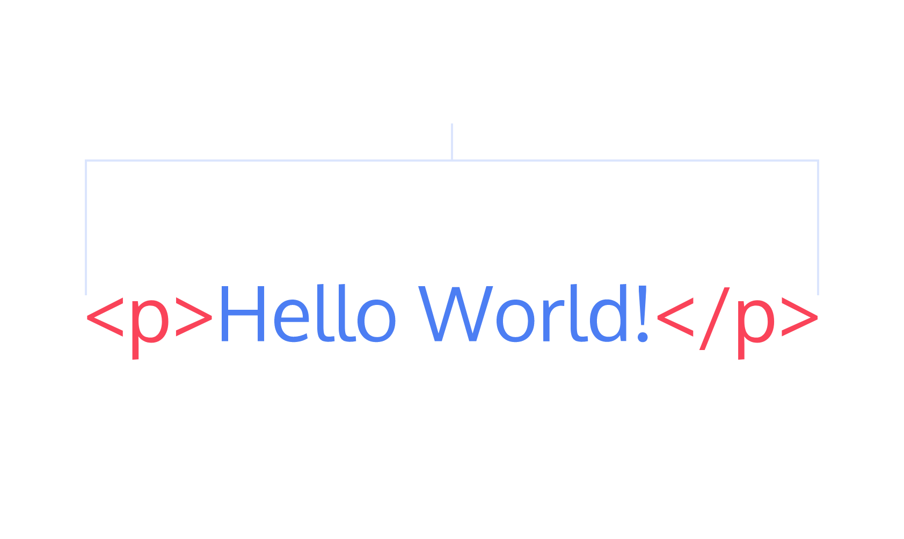

# Giới thiệu về HTML?
- HTML viết tắt của Hyper Text Markup Language
- HTML mô tả cấu trúc của trang web
- Các phần tử HTML cho trình duyệt biết cách hiển thị nội dùng trang web như thế nào
Các phần tử của HTML chia làm nhiều phần như “Phần mở đầu(heading)”, “phần đoạn văn bản”,..
- Vào 1 website bất kỳ rồi inspect lên ta sẽ thấy phần html cho website
## VD về html :
```
    <!DOCTYPE html>
    <html>
    <head>
    <title>Page Title</title>
    </head>
    <body>
    <h1>My First Heading</h1>
    <p>My first paragraph.</p>
    </body>
    </html> 
```
## Giải thích :
- '<!DOCTYPE html> mô tả đây là 1 file HTML5 và được lưu dưới tên xx.html
- Phần tử <html> là phần tử gốc của trang HTML
- Phần tử <head> chứa thông tin meta về trang HTML
- <title> định nghĩa tiêu đề cho trang web
- <body> định nghĩa phần thân của website và là phần chứa cho tất cả các nội dung hiển thị, chẳng hạn như tiêu đề, đoạn văn, hình ảnh, liên kết, bảng, danh sách, v.v.
- <h1> định nghĩa cho 1 tiêu đề lớn
- <p> => định nghĩa cho 1 đoạn văn

## Cấu trúc 1 thẻ html :
- 
# Cấu thành phần chính của 1 trang web html
## Phần head :
- Năm ngoài và ở trên thẻ body
- Có tittle chính là phần hiển thị trên tab của trang web
## Phần body :
- Chỉ có nội dung để trong body là hiển thị ra màn hình.
- Thẻ p ở bên trong body => child của element body, thường sẽ được lùi vào 1 dòng
```
<body>
  <p>What's up, doc?</p>
</body>
```
## Heading:
- Tiêu đề : VD tiêu đề của 1 bài báo bold đậm, hiển thị to nổi bật.
- Sử dụng các thẻ h1 -> h6
```
<body>
  <h1>The Brown Bear</h1>
  <h2>About Brown Bears</h2>
  <h3>Species</h3>
  <h3>Features</h3>
  <h2>Habitat</h2>
  <h3>Countries with Large Brown Bear Populations</h3>
  <h3>Countries with Small Brown Bear Populations</h3>
  <h2>Media</h2>
</body>
```


## Thẻ div - division
- Để chia trang web ra thành nhiều phần, hữu ích để nhóm các phần tử html lại vơi nhau
```

<body>
  <div>
    <h1>Why use divs?</h1>
    <p>Great for grouping elements!</p>
  </div>
</body>


<body>
  <h1>The Brown Bear</h1>
  <div>
    <h2>About Brown Bears</h2>
    <h3>Species</h3>
    <h3>Features</h3>
  </div>
  <div>
    <h2>Habitat</h2>
    <h3>Countries with Large Brown Bear Populations</h3>
  </div>
  <h3>Countries with Small Brown Bear Populations</h3>
  <div>
    <h2>Media</h2>
  </div>
</body>

```
## Attribute : thuộc tính được định nghĩa bên trong open tag của html gồm 2 phần name và value:
```
<div id="intro">
  <h1>Introduction</h1>
</div>
```

```
<body>
  <h1>The Brown Bear</h1>
  <div id="introduction">
    <h2>About Brown Bears</h2>
    <h3>Species</h3>
    <h3>Features</h3>
  </div>
  <div id="habitat">
    <h2>Habitat</h2>
    <h3>Countries with Large Brown Bear Populations</h3>
    <h3>Countries with Small Brown Bear Populations</h3>
  </div>
  <div id="media">
    <h2>Media</h2>
  </div>
</body>
```

## Hiển thị chữ trong html :
- Sử dụng thẻ p hoặc thẻ span
- Thẻ span thì có thể ở cùng 1 hàng với các phần tử khác
- Thẻ p thì một mình một hàng
- Để trang trí cho chữ ta dùng <em> in nghiên, <strong> thì sẽ bold đậm chữ
```
<div>
  <h1>Technology</h1>
</div>
<div>
  <p><span>Self-driving cars</span> are anticipated to replace up to 2 million jobs over the next two decades.</p>
</div>
```

```
<body>
  <h1>The Brown Bear</h1>
  <div id="introduction">
    <h2>About Brown Bears</h2>
    <p>
      “The brown bear (Ursus arctos) is native to parts of northern Eurasia and North America. Its conservation status is currently Least Concern. There are many subspecies within the brown bear species, including the Atlas bear and the Himalayan brown bear.”
    </p>
    <h3>Species</h3>
    <h3>Features</h3>
    <p>
      “Brown bears are not always completely brown. Some can be reddish or yellowish. They have very large, curved claws and huge paws. Male brown bears are often 30% larger than female brown bears. They can range from 5 feet to 9 feet from head to toe.”
    </p>
  </div>
  <div id="habitat">
    <h2>Habitat</h2>
    <h3>Countries with Large Brown Bear Populations</h3>
    <h3>Countries with Small Brown Bear Populations</h3>
    <p>
      “Some countries with smaller brown bear populations include Armenia, Belarus, Bulgaria, China, Finland, France, Greece, India, Japan, Nepal, Poland, Romania, Slovenia, Turkmenistan, and Uzbekistan.”
    </p>
  </div>
  <div id= "media">
    <h2>Media</h2>
  </div>
</body>


```

```
<body>
  <h1>The Brown Bear</h1>
  <div id="introduction">
    <h2>About Brown Bears</h2>
    <p>The brown bear (<em>Ursus arctos</em>) is native to parts of northern Eurasia and North America. Its conservation status is currently <strong>Least Concern</strong>. There are many subspecies within the brown bear species, including the Atlas bear and the Himalayan brown bear.</p>
    <h3>Species</h3>
    <h3>Features</h3>
    <p>Brown bears are not always completely brown. Some can be reddish or yellowish. They have very large, curved claws and huge paws. Male brown bears are often 30% larger than female brown bears. They can range from 5 feet to 9 feet from head to toe.</p>
  </div>
  <div id="habitat">
    <h2>Habitat</h2>
    <h3>Countries with Large Brown Bear Populations</h3>
    <h3>Countries with Small Brown Bear Populations</h3>
    <p>Some countries with smaller brown bear populations include Armenia, Belarus, Bulgaria, China, Finland, France, Greece, India, Japan, Nepal, Poland, Romania, Slovenia, Turkmenistan, and Uzbekistan.</p>
  </div>
  <div id="media">
    <h2>Media</h2>
  </div>
</body>

```

## Line break: ngắt dòng
- Sử dụng <br> element
- Nếu thêm 2 lần <br> thì sẽ xuống dòng 2 lần
```
<p>The Nile River is the longest river <br> in the world, measuring over 6,850 <br> kilometers long (approximately 4,260 <br> miles).</p>
```
## Unordered Lists : danh sách không sắp xếp
```
<ul>
  <li>Limes</li>
  <li>Tortillas</li>
  <li>Chicken</li>
</ul>
```

## Ordered Lists: danh sách có sắp xếp 
```
<ol>
  <li>Preheat the oven to 350 degrees.</li>
  <li>Mix whole wheat flour, baking soda, and salt.</li>
  <li>Cream the butter, sugar in separate bowl.</li>
  <li>Add eggs and vanilla extract to bowl.</li>
</ol>
```

## Img:
- Là thẻ để cho anh vào website, self-closing tag
- Thuộc tính src để cho nguồn ảnh vô, 
- thuộc tính alt="A field of yellow sunflowers" để hiển thị khi ảnh hiển thị lỗi (internet...), mô tả ảnh, tối ưu tìm kiếm SEO
```

```
## Video:
```
<video src="myVideo.mp4" width="320" height="240" controls>
  Video not supported
</video>
```
## Linking to Other Web Pages
- có thuộc tính href (hyperlink reference)
- Muốn mở ra 1 tab mới ta sẽ để target="_blank"
- Linking to Relative Page (trong cùng 1 thư mục)
- Bọc lấy các phần tử khác để biến thành một địa chỉ
- Linking to Same Page (trỏ đến id của các phần tử khác bên trong 1 page)
```
<a href="https://www.wikipedia.org/">This Is A Link To Wikipedia</a>
```
## Comment
## Thực hành :
Vào trang này đăng ký tài khoản
https://www.codecademy.com/courses/learn-html/lessons/intro-to-html/exercises/intro
Sau đó làm các phần Introduction to HTML và HTML Document Standards
Coding
Lập trình trực tiếp online: https://replit.com/
