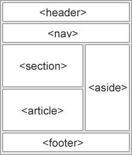

## Semantic elements = elements with a meaning.				
## What are Semantic Elements?				
    A semantic element clearly describes its meaning to both the browser and the developer.
    Examples of non-semantic elements: <div> and <span> - Tells nothing about its content.
    Examples of semantic elements: <form>, <table>, and <article> - Clearly defines its content.

## Semantic Elements in HTML				
 - Many web sites contain HTML code like: `<div id=""nav""> <div class=""header""> <div id=""footer"">` to indicate navigation, header, and footer.

## In HTML there are some semantic elements that can be used to define different parts of a web page:			
```html
<article>
<aside>
<details>
<figcaption>
<figure>
<footer>
<header>
<main>
<mark>
<nav>
<section>
<summary>
<time>
```
    Example structure of webpage


## Details :
- Header and Nav :
  - `header` is a container usually for either navigational links or introductory content containing `<h1>` to `<h6>`headings.
  - `nav` :  is used to define a block of navigation links such as menus and tables of contents
```html
<header>
  <h1>
     Everything you need to know about pizza!
  </h1>
</header>

<div id="header">
    <h1>
        Everything you need to know about pizza!
    </h1>
</div>

```
- Main and Footer :
  - `main` : is used to encapsulate the dominant content within a webpage
  - `footer` :  The footer contains information such as:
    - Contact information
    - Copyright information
    - Terms of use
    - Site Map
    - Reference to top of page links
```html
<main>
  <header>
    <h1>Types of Sports</h1>
  </header>
  <article>
    <h3>Baseball</h3>
    <p>
      The first game of baseball was played in Cooperstown, New York in the summer of 1839.
    </p>
  </article>
</main>

<footer>
    <p>Email me at Codey@Codecademy.com</p>
</footer>
```
- Article and Section :
  - `section` defines elements in a document, such as chapters, headings, or any other area of the document with the same theme.
  - `article` : can hold content such as articles, blogs, comments, magazines, etc. help someone using a screen reader understand where the article content (that might contain a combination of text, images, audio, etc.) begins and ends
```html
<section>
  <h2>Fun Facts About Cricket</h2> 
</section>

<section>
    <h2>Fun Facts About Cricket</h2>
    <article>
        <p>A single match of cricket can last up to 5 days.</p>
    </article>
</section>
```
- The Aside Element:  element is used to mark additional information that can enhance another element but isn’t required in order to understand the main content
```html
<article>
    <p>The first World Series was played between Pittsburgh and Boston in 1903 and was a nine-game series.</p>
</article>
<aside>
    <p>
        Babe Ruth once stated, “Heroes get remembered, but legends never die.”
    </p>
</aside>
```
- Figure and Figcaption :
  - `<figure>` is an element used to encapsulate media such as an image, illustration, diagram, code snippet, etc, which is referenced in the main flow of the document.
  - `figcaption` is an element used to describe the media in the <figure> tag.
```html
<figure>
  
</figure>

<figure>
    
    <figcaption>This picture shows characters from Overwatch.</figcaption>
</figure>
```
- Audio and Attributes:
  - The `<audio>` element is used to embed audio content into a document.
```html
<audio>
  <source src="iAmAnAudioFile.mp3" type="audio/mp3">
</audio>
<audio autoplay controls>
```
- Video and Embed :
  - `<video>`,` <embed>`, and `<audio>` elements are used for media files.
```html
<video src="coding.mp4" controls>Video not supported</video>
```