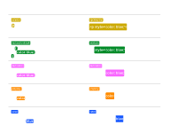

## CSS Anatomy
- Two different methods, or syntaxes, for writing CSS code :
    - ruleset
    - inline style

- Ruleset Terms:
  - Selector—The beginning of the ruleset used to target the element that will be styled.
  - Declaration Block—The code in-between (and including) the curly braces ({ }) that contains the CSS declaration(s).
  - Declaration—The group name for a property and value pair that applies a style to the selected element.
  - Property—The first part of the declaration that signifies what visual characteristic of the element is to be modified.
  - Value—The second part of the declaration that signifies the value of the property.
- Inline Style Terms:
  - Opening Tag—The start of an HTML element. This is the element that will be styled.
  - Attribute—The style attribute is used to add CSS inline styles to an HTML element.
  - Declaration—The group name for a property and value pair that applies a style to the selected element.
  - Property—The first part of the declaration that signifies what visual characteristic of the element is to be modified.
  - Value—The second part of the declaration that signifies the value of the property.



- `Bài tập thực hành :` đổi 1 style từ inline style sang internal style và external style
## Selector :
- Type : type selector matches the type of the element in the HTML document.
```html
p {
  color: green;
}
```
- Universal : the `universal` selector selects all elements of any type.
```html
* { 
  font-family: Verdana;
}
```
- Class : 
```html
<p class='brand'>Sole Shoe Company</p>
// css
.brand {

}
```
- Multiple Classes :
```html
.green {
  color: green;
}
 
.bold {
  font-weight: bold;
}

<h1 class='green bold'> ... </h1>

```
- ID : element needs to be styled uniquely, we can give it an `ID` using the `id` attribute.
```html
<h1 id='large-title'> ... </h1>
#large-title {

}
```
- Attribute
```html


img[src*='winter'] {
height: 50px;
}

img[src*='summer'] {
height: 100px;
}

a[href*='florence'] {
color: lightgreen;
}


```
- Pseudo-class: how the appearance of certain elements can change, or be in a different state, after certain user interaction. all examples of pseudo-class selectors in action! In fact, `:focus`, `:visited`, `:disabled`, and `:active` are all pseudo-classes
```html

p:hover {
  background-color: lime;
}
```
- Specificity :Specificity is the order by which the browser decides which CSS styles will be displayed  `ID > class > type`
```html
<h1 class='headline'>Breaking News</h1>
h1 {
color: red;
}

.headline {
color: firebrick;
}
```

- Chaining:
```html
h1.special {
 
}


```
- Descendant Combinator: 
```html
<ul class='main-list'>
  <li> ... </li>
  <li> ... </li>
  <li> ... </li>
</ul>

.main-list li {

}
```
- Chaining and Specificity :
```html
p {
  color: blue;
}
 
.main p {
  color: red;
}


```
- Multiple Selectors:
```html
h1,
.menu {
font-family: Georgia;
}
```