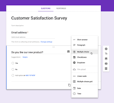

## Các nội dung trong buổi học :
- Định nghĩa về form và các thành phần của form
- Form validation
- Bài tập về form trong mục form
- Quiz nếu có thời gian
## Form
- Chúng ta dùng form hằng ngày, giống như những mẫu form survey, khi điền thông tin thanh toán để nạp coin ..., trang google cũng là 1 form tìm kiếm
- VD về form :
  
```html
<form action="/example.html" method="POST">
</form>
```
- The `action` attribute determines where the information is sent.
- The `method` attribute is assigned a HTTP verb that is included in the HTTP request. (Request trong tiếng Anh nghĩa là lời yêu cầu, lời đề nghị. Trong lập trình Web, HTTP Request được gọi là “thông báo yêu cầu HTTP“. Đây là thông tin từ client gửi đến server, yêu cầu server làm một việc gì đó.)
- Các thành phần bên trong  1 form:
    - Text Input : `type="text"`  without the `name` attribute, information in the `<input>` won’t be sent when the `<form>` is submitted
```html
<form action="/example.html" method="POST">
  <input type="text" name="first-text-field" value="already pre-filled">
</form>
```
- Label:  To associate a `<label>` and an `<input>`, the `<input>` needs an `id` attribute. We then assign the `for` attribute of the `<label>` element with the value of the id attribute of `<input>`, like so:
```html
<form action="/example.html" method="POST">
  <label for="meal">What do you want to eat?</label>
  <br>
  <input type="text" name="food" id="meal">
</form>
```
- Password Input: have to put sensitive information, like a password or PIN, into a `<form>`
```html
<form>
  <label for="user-password">Password: </label>
  <input type="password" id="user-password" name="user-password">
</form>
```
- Number Input: By setting `type="number"` for an `<input>` we can restrict what users type into the input field to just numbers (and a few special characters like `-, +,` and `.`). We can also provide a `step` attribute which creates arrows inside the input field to increase or decrease by the value of the step attribute.
```html
<form>
  <label for="years"> Years of experience: </label>
  <input id="years" name="years" type="number" step="1">
</form>
```
- Range Input: if we wanted to limit what numbers our users could type we might consider using a different type value. Another option we could use is setting type to `"range"` which creates a slider. To set the` minimum and maximum` values of the slider we assign values to the min and max attribute of the `<input>`. We could also control how smooth and fluid the slider works by assigning the `step` attribute a value.
```html
<form>
  <label for="volume"> Volume Control</label>
  <input id="volume" name="volume" type="range" min="0" max="100" step="1">
</form>
```
- `hr` tag : An element that is used to a break between paragraph-level elements. It is displayed as a horizontal line
- Checkbox Input:
    - there are assigned values to the value attribute of the checkboxes. These values are not visible on the form itself, that’s why it is important that we use an associated `<label>` to identify the checkbox.
    - each `<input>` has the same value for the name attribute. Using the same name for each checkbox groups the `<input>`s together. However, each `<input>` has a unique id to pair with a `<label>`.
```html
<form>
  <p>Choose your pizza toppings:</p>
  <label for="cheese">Extra cheese</label>
  <input id="cheese" name="topping" type="checkbox" value="cheese">
  <br>
  <label for="pepperoni">Pepperoni</label>
  <input id="pepperoni" name="topping" type="checkbox" value="pepperoni">
  <br>
  <label for="anchovy">Anchovy</label>
  <input id="anchovy" name="topping" type="checkbox" value="anchovy">
</form>
```
- Radio Button Input: like asking users if they agree or disagree with the terms and conditions.
    - To group radio buttons together, we assign them the same `name` and only one radio button from that group can be selected.
```html
<form>
  <p>What is sum of 1 + 1?</p>
  <input type="radio" id="two" name="answer" value="2">
  <label for="two">2</label>
  <br>
  <input type="radio" id="eleven" name="answer" value="11">
  <label for="eleven">11</label>
</form>
```
- Dropdown list:
```html
<form>
  <label for="lunch">What's for lunch?</label>
  <select id="lunch" name="lunch">
    <option value="pizza">Pizza</option>
    <option value="curry">Curry</option>
    <option value="salad">Salad</option>
    <option value="ramen">Ramen</option>
    <option value="tacos">Tacos</option>
  </select>
</form>
```
- Datalist Input:  Even if we have an organized dropdown list, if the list has a lot of options, it could be tedious for users to scroll through the entire list to locate one option. That’s where using the `<datalist>` element comes in handy.
    - In the associated <input> element, users can type in the input field to search for a particular option. If none of the `<option>`s match, the user can still use what they typed in
```html
<form>
  <label for="city">Ideal city to visit?</label>
  <input type="text" list="cities" id="city" name="city">
 
  <datalist id="cities">
    <option value="New York City"></option>
    <option value="Tokyo"></option>
    <option value="Barcelona"></option>
    <option value="Mexico City"></option>
    <option value="Melbourne"></option>
    <option value="Other"></option>  
  </datalist>
</form>
```
- Textarea element: An `<input> element with `type="text"` creates a single row input field for users to type in information. However, there are cases where users need to write in more information, like a blog post. In such cases, instead of using an `<input>`, we could use `<textarea>`.
```html
<form>
  <label for="blog">New Blog Post: </label>
  <br>
  <textarea id="blog" name="blog" rows="5" cols="30">
  </textarea>
</form>
```
- Submit Form: Remember, the purpose of a form is to collect information that will be submitted.
```html
<form>
  <input type="submit" value="Send">
</form>
```
- Form Validation:
    - Requiring an Input : we can add the `required` attribute to an `<input>` element

```html
<form action="/example.html" method="POST">
  <label for="allergies">Do you have any dietary restrictions?</label>
  <br>
  <input id="allergies" name="allergies" type="text" required>
  <br>
  <input type="submit" value="Submit">
</form>
```
    - Set a Minimum and Maximum : Another built-in validation we can use is to assign a minimum or maximum value for a number field, e.g. `<input type="number">` and `<input type="range">`.
```html
<form action="/example.html" method="POST">
  <label for="guests">Enter # of guests:</label>
  <input id="guests" name="guests" type="number" min="1" max="4">
  <input type="submit" value="Submit">
</form>
```
    - Checking Text Length: 
```html
<form action="/example.html" method="POST">
  <label for="summary">Summarize your feelings in less than 250 characters</label>
  <input id="summary" name="summary" type="text" minlength="5" maxlength="250" required>
  <input type="submit" value="Submit">
</form>
```
    - Matching a Pattern: we use the `pattern` attribute and assign it a regular expression, or regex.
      - "[a-zA-Z0-9]+"
```html
<form action="/example.html" method="POST">
  <label for="payment">Credit Card Number (no spaces):</label>
  <br>
  <input id="payment" name="payment" type="text" required pattern="[0-9]{14,16}">
  <input type="submit" value="Submit">
</form>
```
