# Bài tập cơ bản
- ListBasic
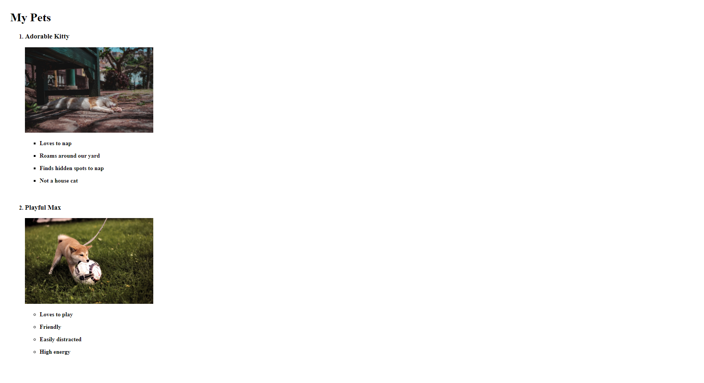
- TableSchedule
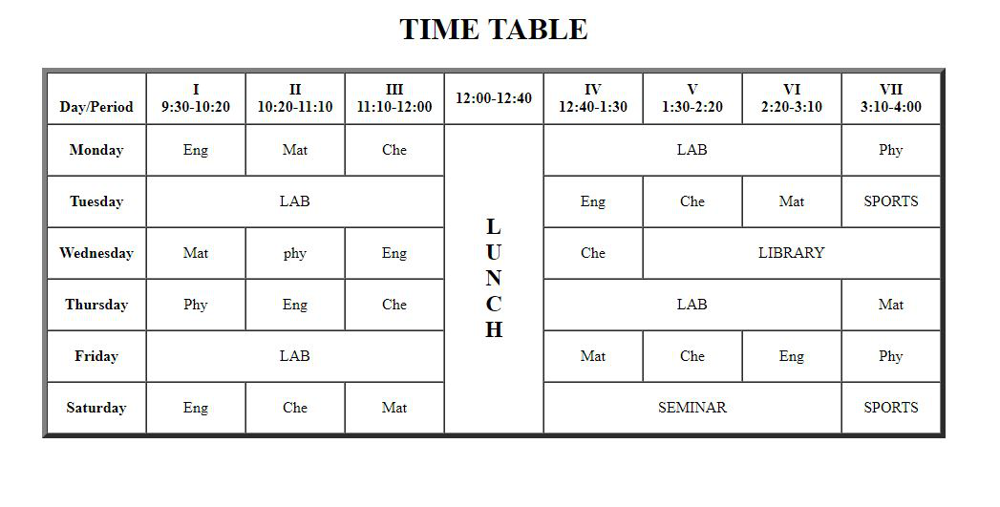
- FormBeauty
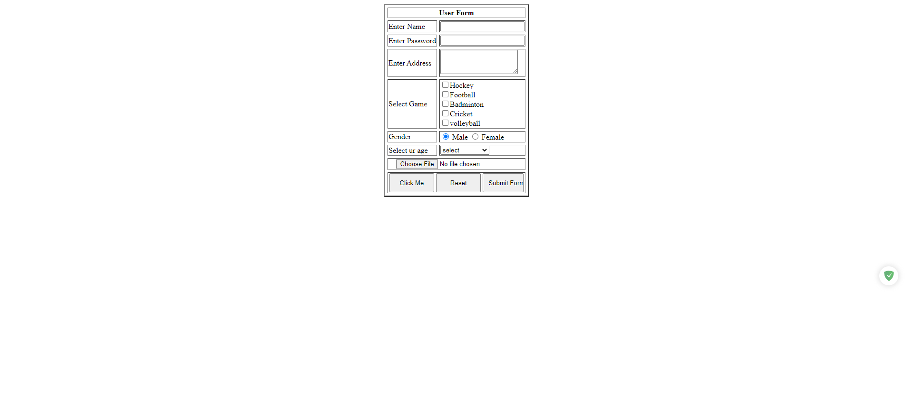
# Bài tập về flex (chia lay out)
- FlexLayOut1
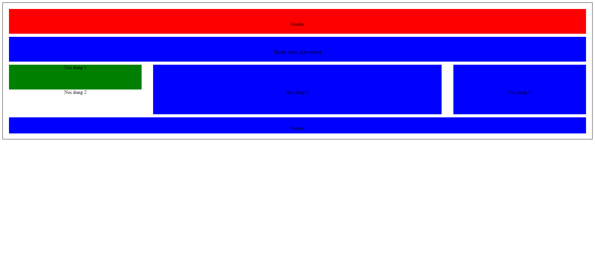
- FlexLayOut2
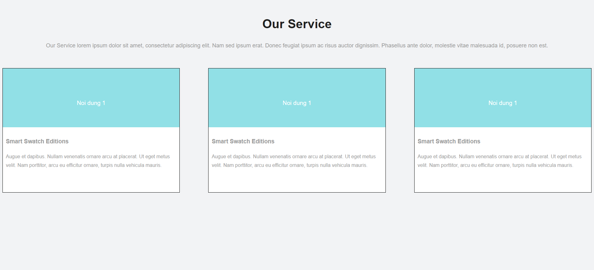
- SimpleListInstagram
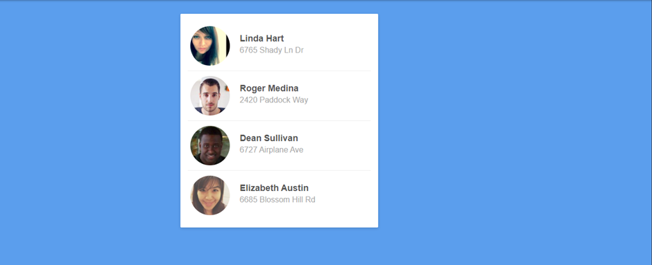
- FlexLayOutAdvance
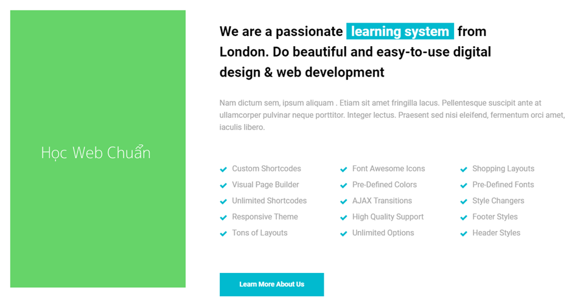
- FlexLayOutFullWebsite
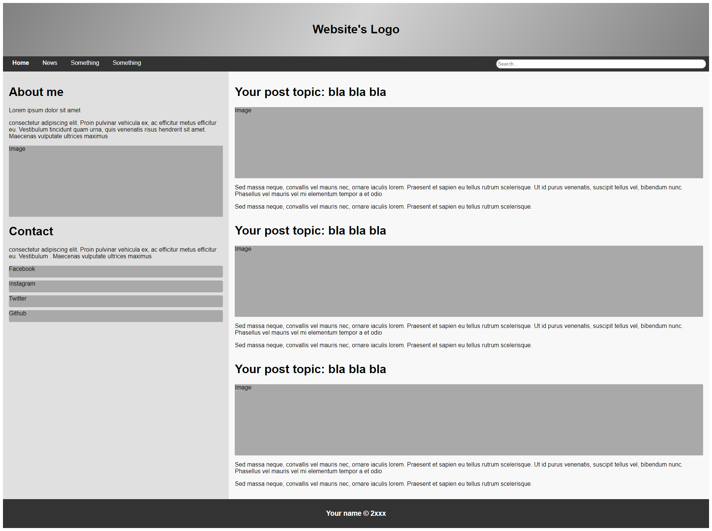
# Bài tập tổng hợp
- Page CV
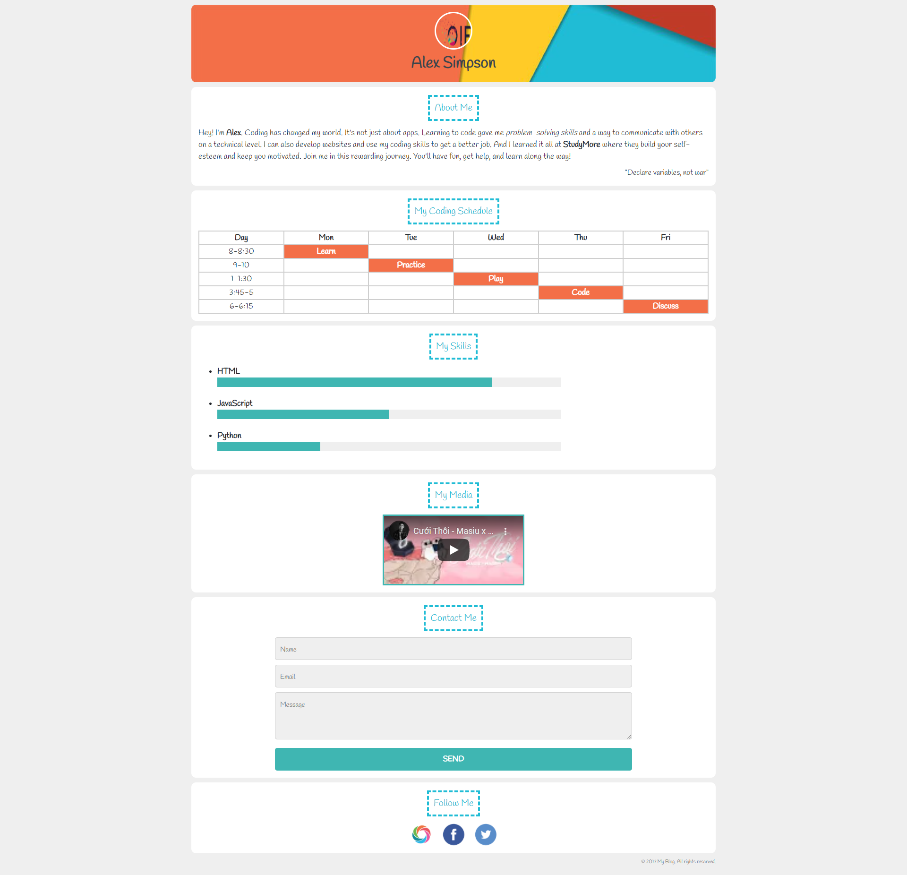
- GoogleFake
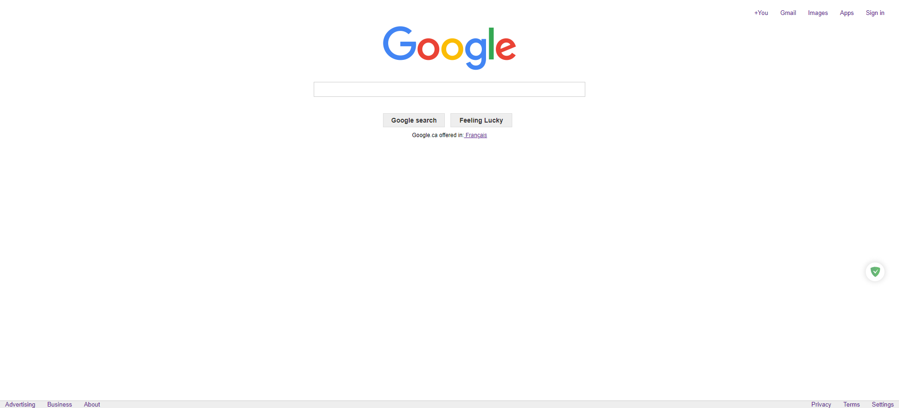
- LandingPage
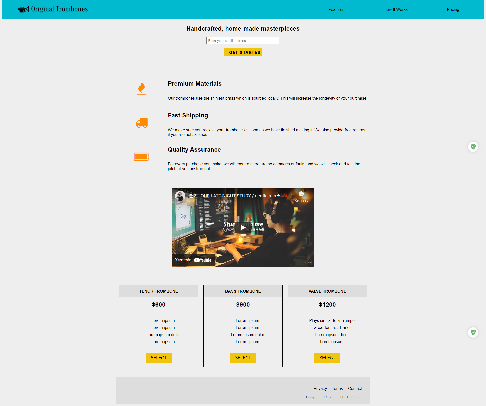
# Final Project
