# Bài tập cơ bản
- ListBasic
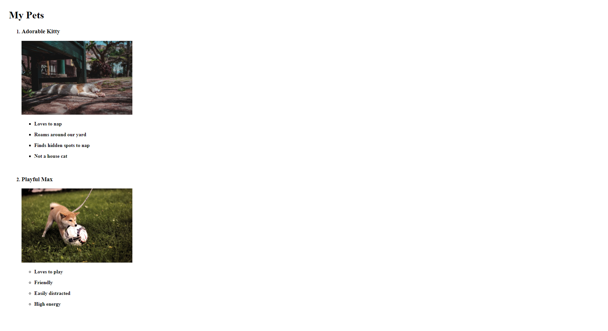
- TableSchedule
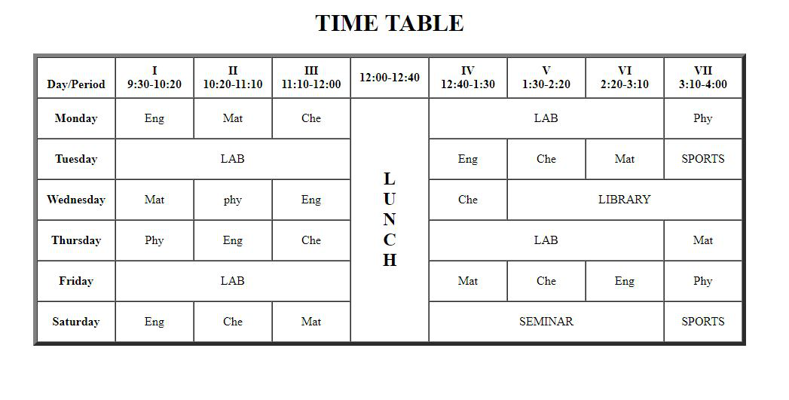
- FormBeauty
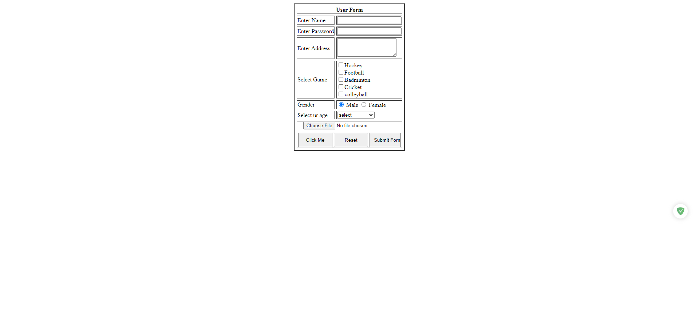
- Nutrition

- ColorMarkers
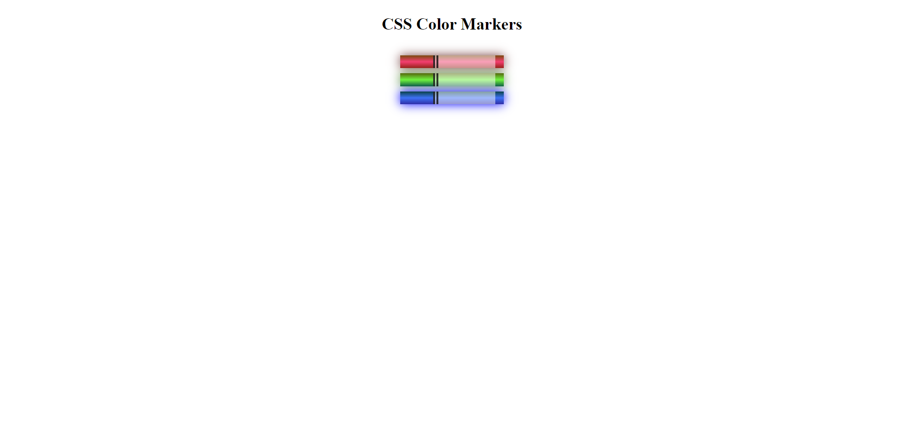
# Bài tập về flex (chia lay out)
- FlexLayOut0
  
- FlexLayOut1
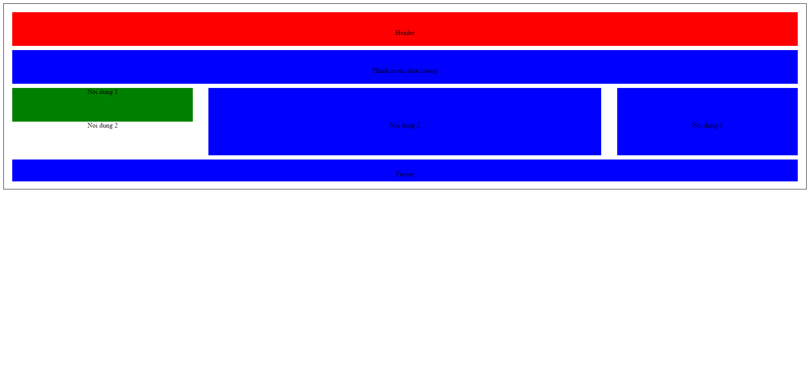
- FlexLayOut2
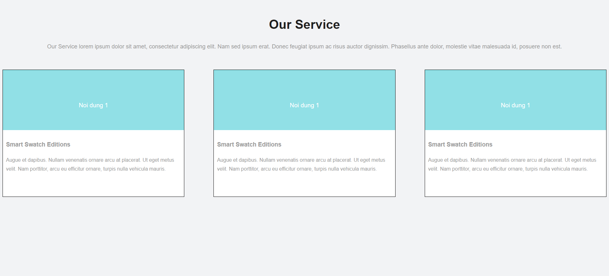
- FlexLayOut3
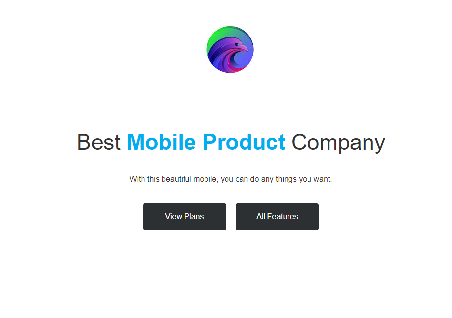
- FlexLayOut4
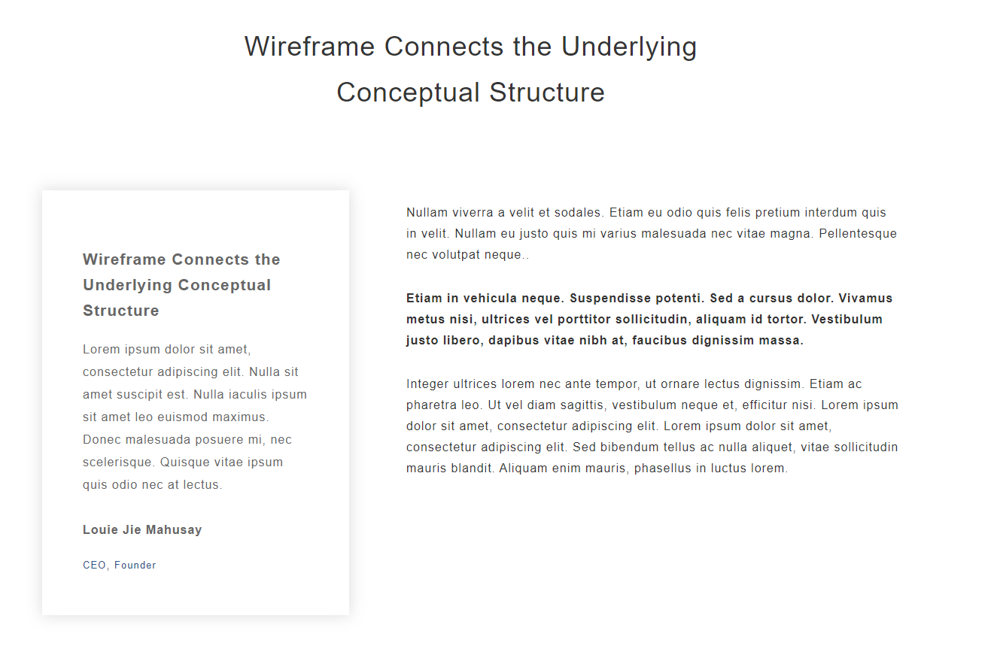
- SimpleListInstagram
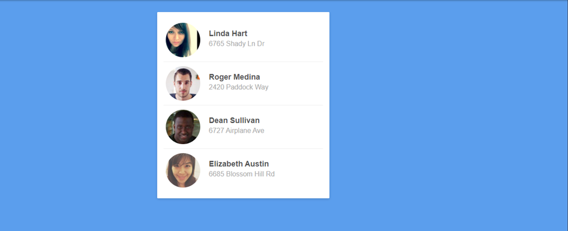
- FlexLayOutAdvance
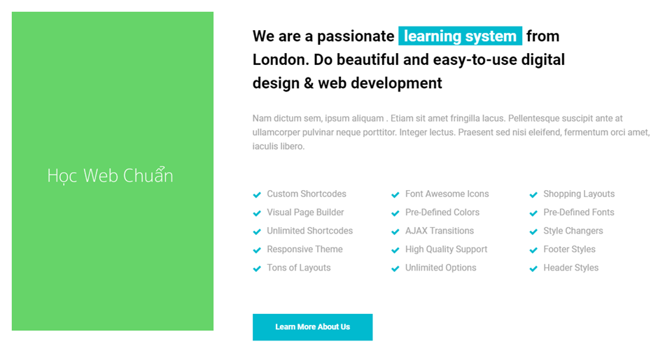
- FlexLayOutFullWebsite
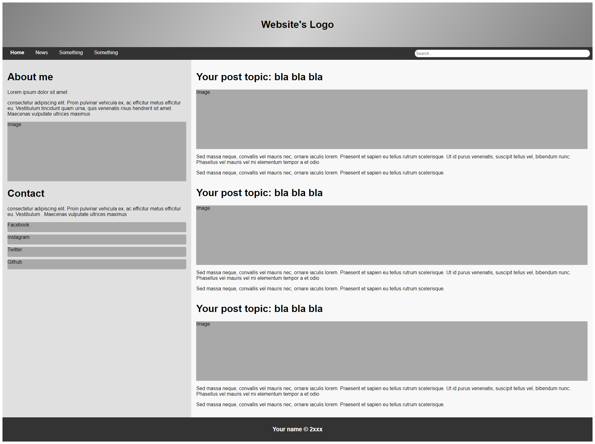
# Boostrap Design
- Checkout form
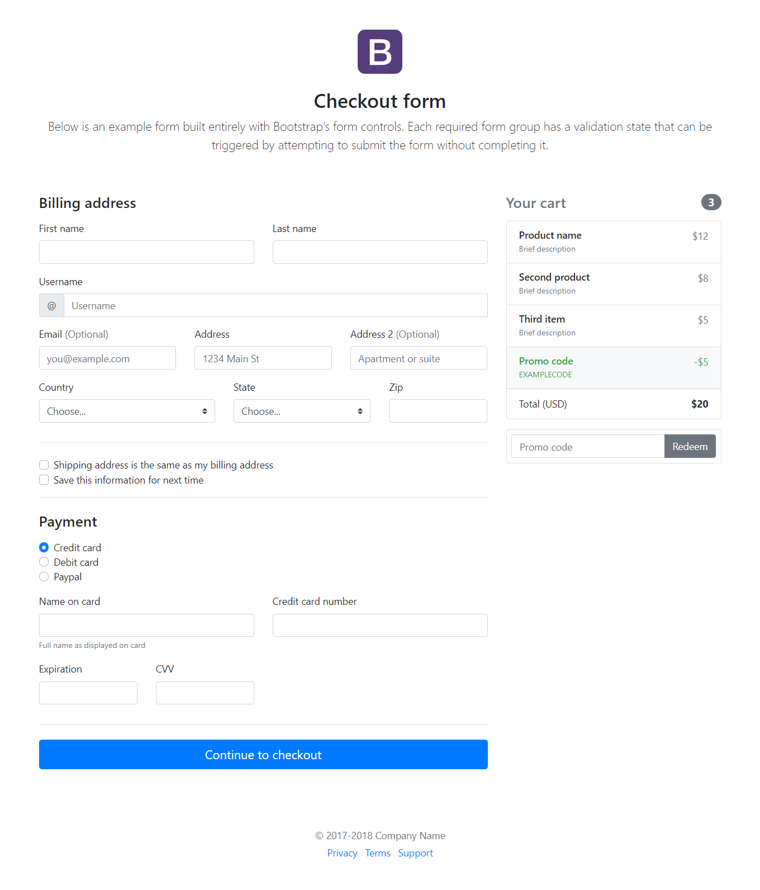
- Heading page
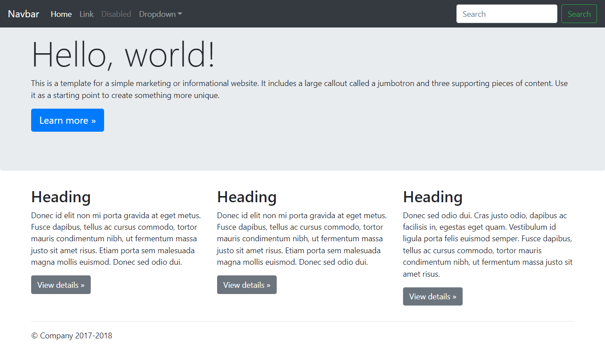
# Bài tập tổng hợp
- Page CV
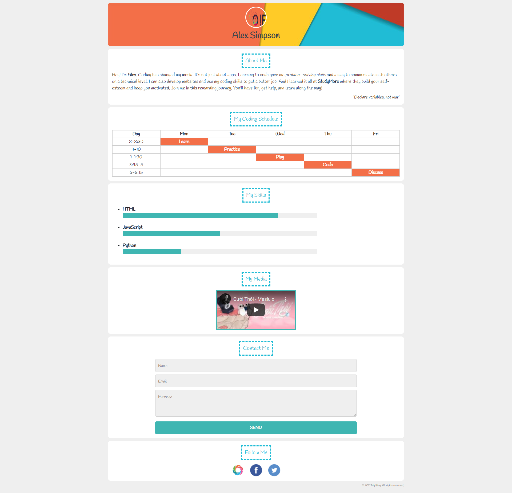
- GoogleFake
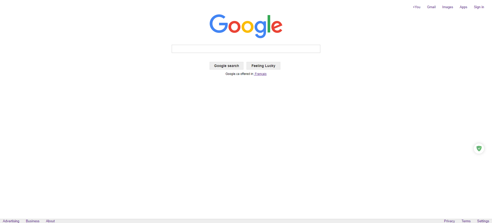
- LandingPage
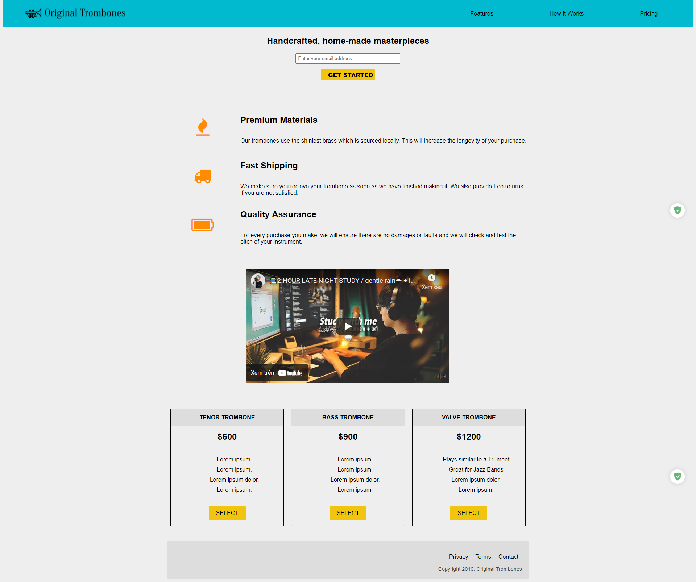
# Final Project
