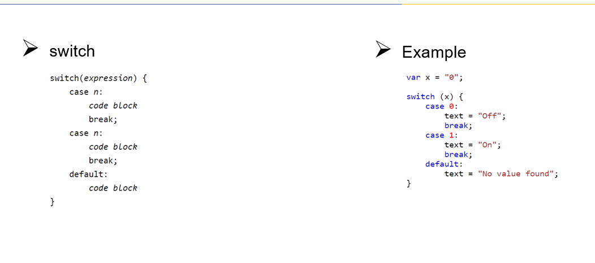
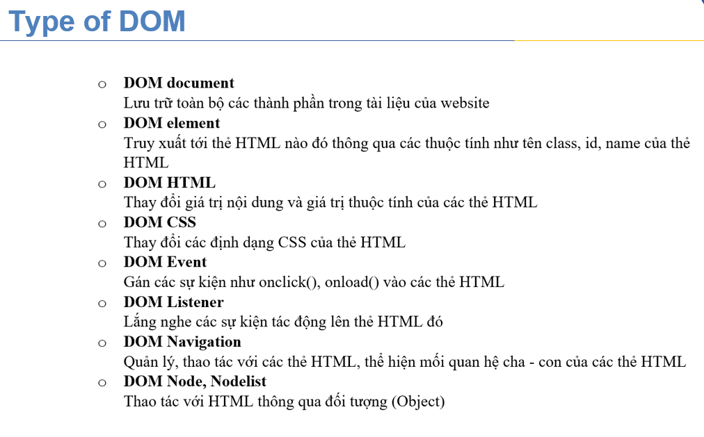

## Tính coin giải thưởng (10 phút) :
## Đường dẫn file (tương đôi relative và tuyệt đối (absolute)):

Nói về trường hợp của Xanh
Nói về tên file có dấu cách

## Cách đặt tên file:
- Tất cả các file (ngay cả trên máy Mac) đều có đuôi file mở rộng. Đảm bảo bạn đang sử dụng đúng phần mở rộng khi lưu file.
  - Các file HTML kết thúc bằng .html
  - Các file CSS kết thúc bằng .css
  - file hình ảnh kết thúc bằng .jpg, .png hoặc .gif, tùy thuộc vào kiểu file đó.
  - Các file JavaScript kết thúc bằng .js
- Tên file không bao giờ có dấu cách
  - Trên máy Mac hoặc PC, bạn có thể lưu file có tên “my awesome.html”. Điều này có thể sẽ không hoạt động trên một trang web.
  - Sử dụng dấu gạch ngang trong tên file của bạn thay vì để chỉ khoảng trống. Tên file của bạn sẽ là “my-awesome-website.html” thay thế.
https://hocjavascript.net/clean-code-refactoring/quy-tac-dat-ten-file/

#1. Các nội dung chính của javascript
## Datatype : Kiểu dữ liệu
  - Primitive :
    - string
    - number
    - boolean : isNaN();
  - Object :
    - Cách khai báo :
      - 
    - Tạo phương thức cho nó :
      - 
  - Array :
    - 
## Flow control: 
  - If, else : Có hoặc không
    - 
  - Switch :
    - 
  - For: Vòng lặp
    - 
    - 
## Operator: Các toán tử
 - 
 - 
 - 
## Variable: Khai báo biến
 - 
## Strict mode:
 - Khi để strict mode thì bắt buộc phải khai báo mới dùng được
 - 
## Scope : Phạm vi khai báo biến
    - Local scope :

    - Global

    - Loop

## Exception:

## Output:

window.console or just console

#2 Demo cách nhúng js vào trang web

- Trong cặp thẻ javascript

```
<!DOCTYPE html>
<html lang="en-US">

<head>
    <meta charset="UTF-8">
    <meta name="viewport" content="width=device-width, initial-scale=1">
    <title>Today's Date</title>
    <script>
        let d = new Date();
        alert("Today's date is " + d);
    </script>
</head>

<body>

</body>
```

- Tạo 1 file javascript riêng

```
project/
├── css/
|   └── style.css
├── js/
|   └── script.js
└── index.html
```

```
<script src="js/script.js"></script>
````

- Nhúng ngay bên trong html

```
<a href="#" onclick="function hi(){alert('Hi!')};hi()">click</a>
```

> VD: Hello world bằng js

# Nội dung chính
## DOM
- Tổng quan về dom

- Các loại dom


## DOm Hay dùng :
    - HTML Element:

    - DOm CSS:

    - Dom document:


## Bài tập :
- Question 1: Tạo 2 button Hide và Show để thể hiện chức năng ẩn và hiện toạn text
  như hình dưới đây:
  https://www.freecodecamp.org/news/javascript-dom-events-onclick-and-onload/
- 


  
