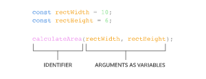

# Function declaration
  - Bind function to a name
  - 
  - hoisting feature in JavaScript ref: https://developer.mozilla.org/en-US/docs/Glossary/Hoisting
# Calling a function
  - a function declaration does not ask the code inside the function body to run  it just declares the existence of the function
  - The code inside a function body runs, or executes, only when the function is called
  - 
  - 
# Parameters and Arguments
  - some functions can take inputs and use the inputs to perform a task. When declaring a function, we can specify its parameters.
  - Parameters allow functions to accept input(s) and perform a task using the input(s). We use parameters as placeholders for information that will be passed to the function when it is called.
  - 
  - 
  - 
# Default Parameters
  - allow parameters to have a predetermined value in case there is no argument passed into the function or if the argument is undefined when called
# Return
  - When a function is called, the computer will run through the function’s code and evaluate the result of calling the function. By default that resulting value is undefined.

  - When a return statement is used in a function body, the execution of the function is stopped and the code that follows it will not be executed.
# Helper Functions
  - 
# Function Expressions
 - Nó là 1 cách khác để khai báo function => điểm khác biệt là không có tính chất hoisting
 - 
# Arrow Functions
 - Cách ngắn gọn để khai báo lại function
# Concise Body Arrow Functions
 - Functions that take only a single parameter do not need that parameter to be enclosed in parentheses. However, if a function takes zero or multiple parameters, parentheses are required.

 - A function body composed of a single-line block does not need curly braces. Without the curly braces, whatever that line evaluates will be automatically returned. The contents of the block should immediately follow the arrow => and the return keyword can be removed. This is referred to as implicit return
