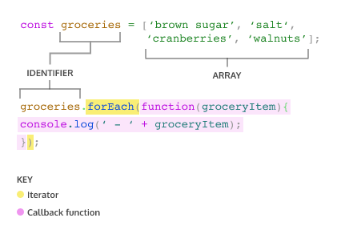

## Higher-order functions and CallBack function
- we can assign functions to variables, and we can reassign them to new variables.
```html
const announceThatIAmDoingImportantWork = () => {
    console.log("I’m doing very important work!");
};
// rename function with shorter name
const busy = announceThatIAmDoingImportantWork;

busy(); // This function call barely takes any space!
```
- If we could look up the address in memory of `busy` and the address in memory of `announceThatIAmDoingImportantWork` they would point to the same place.
- Pass function like parameters :
  - A `higher-order function` is a function that either accepts functions as parameters, returns a function, or both! We call functions that get passed in as parameters `callback functions`.
```html
const higherOrderFunc = param => {
param();
return `I just invoked ${param.name} as a callback function!`
}

const anotherFunc = () => {
return 'I\'m being invoked by the higher-order function!';
}

higherOrderFunc(anotherFunc);
```
 - Pass `anonymous function` (a function without a name) that counts to 10. Anonymous functions can be arguments too!
```html
higherOrderFunc(() => {
  for (let i = 0; i <= 10; i++){
    console.log(i);
  }
});
```
---
## Iterators
- Better tool for loop : have access to built-in array methods which make looping easier.
### The .forEach() Method

- `groceries.forEach()` calls the forEach method on the groceries array.
- `.forEach()` takes an argument of callback function. Remember, a callback function is a function passed as an argument into another function.
- `.forEach()` loops through the array and executes the callback function for each element. During each execution, the current element is passed as an argument to the callback function.
- The return value for `.forEach()` will always be `undefined`.
```html
// way 1
groceries.forEach(groceryItem => console.log(groceryItem));

// way 2
function printGrocery(element){
console.log(element);
}

groceries.forEach(printGrocery);
```

### The .map() Method
- it takes an argument of a callback function and returns a new array! 
```html
const numbers = [1, 2, 3, 4, 5]; 
 
const bigNumbers = numbers.map(number => {
  return number * 10;
});

console.log(numbers); // Output: [1, 2, 3, 4, 5]
console.log(bigNumbers); // Output: [10, 20, 30, 40, 50]
```
Explain :
  - `numbers` is an array of numbers.
  - `bigNumbers` will store the return value of calling `.map()` on numbers.
  - `numbers.map` will iterate through each element in the numbers array and pass the element into the callback function.
  - `return number * 10` is the code we wish to execute upon each element in the array. This will save each value from the numbers array, multiplied by 10, to a new array.
### The .filter() Method
  - The callback function for the `.filter()` method should return `true` or `false` depending on the element that is passed to it. The elements that cause the callback function to return true are added to the new array. Take a look at the following example:
```html
const words = ['chair', 'music', 'pillow', 'brick', 'pen', 'door']; 
 
const shortWords = words.filter(word => {
  return word.length < 6;
});

console.log(words); // Output: ['chair', 'music', 'pillow', 'brick', 'pen', 'door'];
console.log(shortWords); // Output: ['chair', 'music', 'brick', 'pen', 'door']
```
Explain :
- `words` is an array that contains string elements.
- `const shortWords` = declares a new variable that will store the returned array from invoking .filter().
- The callback function is an arrow function that has a single parameter, word. Each element in the words array will be passed to this function as an argument.
- `word.length < 6;` is the condition in the callback function. Any word from the words array that has fewer than 6 characters will be added to the `shortWords` array.

### The .findIndex() Method
- Calling `.findIndex()` on an array will return the index of the first element that evaluates to `true` in the callback function.
- If there isn’t a single element in the array that satisfies the condition in the callback, then `.findIndex()` will return `-1`.
```html
const jumbledNums = [123, 25, 78, 5, 9]; 
 
const lessThanTen = jumbledNums.findIndex(num => {
  return num < 10;
});
console.log(lessThanTen); // Output: 3


const greaterThan1000 = jumbledNums.findIndex(num => {
return num > 1000;
});

console.log(greaterThan1000); // Output: -1

```
Explain :
- `jumbledNums` is an array that contains elements that are numbers.
- `const lessThanTen =` declares a new variable that stores the returned index number from invoking .findIndex().
- The callback function is an arrow function that has a single parameter, num. Each element in the `jumbledNums` array will be passed to this function as an argument.
- `num < 10;` is the condition that elements are checked against. .findIndex() will return the index of the first element which evaluates to true for that condition.
### The .reduce() Method
- returns a single value after iterating through the elements of an array, thereby reducing the array. Take a look at the example below:
```html
const numbers = [1, 2, 4, 10];
 
const summedNums = numbers.reduce((accumulator, currentValue) => {
  return accumulator + currentValue
})
 
console.log(summedNums) // Output: 17
```
Explain

| Iteration  | accumulator | currentValue | return value |
|------------|-------------|--------------|--------------|
| First      | 1           | 2            | 3            |
| Second     | 3           | 4            | 7            |
| Third      | 7           | 10           | 17           |
- The `.reduce()` method can also take an optional second parameter to set an initial value for accumulator (remember, the first argument is the callback function!). For instance:
```html
const numbers = [1, 2, 4, 10];
 
const summedNums = numbers.reduce((accumulator, currentValue) => {
  return accumulator + currentValue
}, 100)  // <- Second argument for .reduce()
 
console.log(summedNums); // Output: 117
```
Explain

| Iteration  | accumulator | currentValue | return value |
|------------|-------------|--------------|--------------|
| First      | 100         | 1            | 101          |
| Second     | 101         | 2            | 103          |
| Third      | 103         | 4            | 107          |
| Fourth     | 107         | 10           | 117          |

### The .every() method: The `every()` method tests whether all elements in the array pass the test implemented by the provided function. It returns a Boolean value.

```html
const isBelowThreshold = (currentValue) => currentValue < 40;

const array1 = [1, 30, 39, 29, 10, 13];

console.log(array1.every(isBelowThreshold));
// expected output: true
```