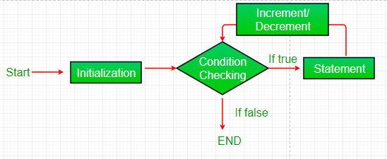
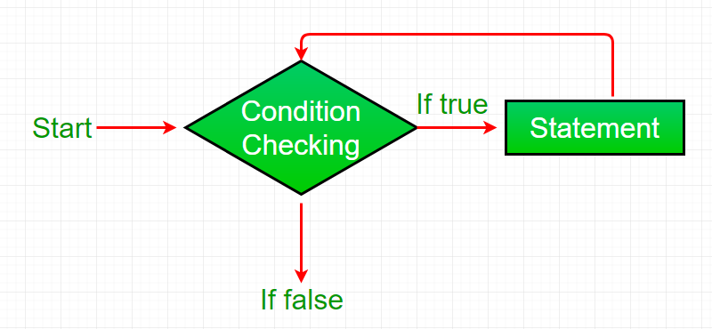

## Loop
Flowchart:

- Loop là 1 công cụ để thực hiện đi thực hiện lại 1 việc nhiều lần, chỉ dừng khi gặp điều kiện xác định
- loops iterate or repeat an action until a specific condition is met.
- VD: gặp nửa kia, tán tỉnh, yêu, chia tay => chỉ dừng lại cho đến khi lập gia đình.
```html
// Write your code below
let vacationSpots = ['Ha Noi', 'HCM','Danang'];
console.log(vacationSpots[0]);
console.log(vacationSpots[1]);
console.log(vacationSpots[2]);


```
- A for loop contains three expressions separated by `;` inside the parentheses:
  - an initialization starts the loop and can also be used to declare the iterator variable.
  - a stopping condition is the condition that the iterator variable is evaluated against— if the condition evaluates to true the code block will run, and if it evaluates to false the code will stop.
  - an iteration statement is used to update the iterator variable on each loop.
```html
for (let counter = 0; counter < 4; counter++) {
  console.log(counter);
}
```
- Looping in Reverse
- Looping through Arrays
```html
const animals = ['Grizzly Bear', 'Sloth', 'Sea Lion'];
for (let i = 0; i < animals.length; i++){
  console.log(animals[i]);
}
```
- Nested Loops : a loop running inside another loop
```html
const myArray = [6, 19, 20];
const yourArray = [19, 81, 2];
for (let i = 0; i < myArray.length; i++) {
  for (let j = 0; j < yourArray.length; j++) {
    if (myArray[i] === yourArray[j]) {
      console.log('Both loops have the number: ' + yourArray[j])
    }
  }
};
```
    - Small Exercise : Tạo 1 mảng tên 4 người bạn của bạn, chọn ra 1 người bạn của bạn rồi tạo ra 1 mảng tên người bạn của người bạn đó, đảm bảo 2 mảng có bạn chung, tìm ra và đẩy vào 1 mảng tên các người bạn chung
## While Loop
Flowchart

```html
// A for loop that prints 1, 2, and 3
for (let counterOne = 1; counterOne < 4; counterOne++){
  console.log(counterOne);
}
 
// A while loop that prints 1, 2, and 3
let counterTwo = 1;
while (counterTwo < 4) {
  console.log(counterTwo);
  counterTwo++;
}
```
- Remember, this is called an `infinite loop` and it’s something we always want to avoid.
- Small exercise : Cho 1 mảng gồm 4 const cards = ['diamond', 'spade', 'heart', 'club']; dùng vòng lặp while dừng lại cho đến khi tìm ra `spade`, `currentCard = cards[Math.floor(Math.random() * 4)];`
## Do...While Statements
```html
let countString = '';
let i = 0;
 
do {
  countString = countString + i;
  i++;
} while (i < 5);

console.log(countString);
```