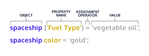

#Object

##Creating Objects
- We use curly braces, `{}`, to designate an object literal:
```html
let spaceship = {}; // spaceship is an empty object
```
- Data of object:  data is organized into key-value pairs 
```html
// An object literal with two key-value pairs
let spaceship = {
  'Fuel Type': 'diesel',
  color: 'silver'
};
```
    The spaceship object has two properties Fuel Type and color. 'Fuel Type' has quotation marks because it contains a space character.
- Accessing Properties: 
  - Let’s explore the first way— dot notation, `.`
  - Bracket Notation (use bracket notation when accessing keys that have numbers, spaces, or special characters in them)
```html
let spaceship = {
homePlanet: 'Earth',
color: 'silver'
};
spaceship.homePlanet; // Returns 'Earth',
spaceship.color; // Returns 'silver',

// If we try to access a property that does not exist on that object, undefined will be returned.

spaceship.favoriteIcecream; // Returns undefined
```

```html
let spaceship = {
  'Fuel Type': 'Turbo Fuel',
  'Active Duty': true,
  homePlanet: 'Earth',
  numCrew: 5
};
spaceship['Active Duty'];   // Returns true
spaceship['Fuel Type'];   // Returns  'Turbo Fuel'
spaceship['numCrew'];   // Returns 5
spaceship['!!!!!!!!!!!!!!!'];   // Returns undefined

let returnAnyProp = (objectName, propName) => objectName[propName];

returnAnyProp(spaceship, 'homePlanet'); // Returns 'Earth'
```
- Property Assignment: Objects are mutable meaning we can update them after we create them!
  - If the property already exists on the object, whatever value it held before will be replaced with the newly assigned value.
  - If there was no property with that name, a new property will be added to the object.
  - You can delete a property from an object with the `delete` operator.
  - 
```html
const spaceship = {type: 'shuttle'};
spaceship = {type: 'alien'}; // TypeError: Assignment to constant variable.
spaceship.type = 'alien'; // Changes the value of the type property
spaceship.speed = 'Mach 5'; // Creates a new key of 'speed' with a value of 'Mach 5'

const spaceship = {
'Fuel Type': 'Turbo Fuel',
homePlanet: 'Earth',
mission: 'Explore the universe'
};

delete spaceship.mission;  // Removes the mission property
```
- Methods: When the data stored on an object is a function we call that a method. A property is what an object has, while a method is what an object does.
```html
const alienShip = {
  invade: function () { 
    console.log('Hello! We have come to dominate your planet. Instead of Earth, it shall be called New Xaculon.')
  }
};

With the new method syntax introduced in ES6 we can omit the colon and the function keyword.
const alienShip = {
invade () {
console.log('Hello! We have come to dominate your planet. Instead of Earth, it shall be called New Xaculon.')
}
};

alienShip.invade(); // Prints 'Hello! We have come to dominate your planet. Instead of Earth, it shall be called New Xaculon.'
```
- Nested Objects: objects are often nested— an object might have another object as a property which in turn could have a property that’s an array of even more objects!
  - We can chain operators to access nested properties.
```html

const spaceship = {
     telescope: {
        yearBuilt: 2018,
        model: '91031-XLT',
        focalLength: 2032 
     },
    crew: {
        captain: { 
            name: 'Sandra', 
            degree: 'Computer Engineering', 
            encourageTeam() { console.log('We got this!') } 
         }
    },
    engine: {
        model: 'Nimbus2000'
     },
     nanoelectronics: {
         computer: {
            terabytes: 100,
            monitors: 'HD'
         },
        'back-up': {
           battery: 'Lithium',
           terabytes: 50
         }
    }
};


spaceship.nanoelectronics['back-up'].battery; // Returns 'Lithium'
```
- Pass By Reference: when we pass a variable assigned to an object into a function as an argument, the computer interprets the parameter name as pointing to the space in memory holding that object. As a result, functions which change object properties actually mutate the object permanently (even when the object is assigned to a `const` variable).
```html
const spaceship = {
  homePlanet : 'Earth',
  color : 'silver'
};
 
let paintIt = obj => {
  obj.color = 'glorious gold'
};
 
paintIt(spaceship);
 
spaceship.color // Returns 'glorious gold'
 
```

```html
However, reassignment of the spaceship variable wouldn’t work in the same way
let spaceship = {
  homePlanet : 'Earth',
  color : 'red'
};
let tryReassignment = obj => {
  obj = {
    identified : false, 
    'transport type' : 'flying'
  }
  console.log(obj) // Prints {'identified': false, 'transport type': 'flying'}
 
};
tryReassignment(spaceship) // The attempt at reassignment does not work.
spaceship // Still returns {homePlanet : 'Earth', color : 'red'};
 
spaceship = {
  identified : false, 
  'transport type': 'flying'
}; // Regular reassignment still works.
```

- Looping Through Objects
```html

const object = { a: 1, b: 2, c: 3 };

for (const property in object) {
  console.log(`${property}: ${object[property]}`);
}

// expected output:
// "a: 1"
// "b: 2"
// "c: 3"


```
