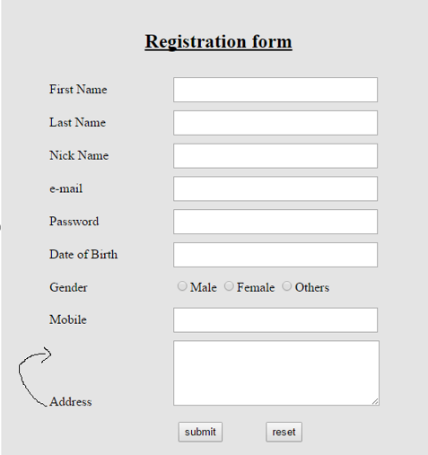

Nguyên Vũ :
# Bài 1 Làm bài liên quan đến img, ul, li, heading
<!DOCTYPE html>
<html>
<head>
<title>Page Title</title>
</head>
<body>

<h1>All about Rabbits!</h1>

<h3>Why Rabbits make great pets</h3>
<ul>
     <li>They're furry!</li>
     <li>Great listeners!</li>
     <li>Eat all your leftover carrots!</li>
<ul/>     

</body>
</html>

## Bài 2:
<!DOCTYPE html>
<html>
<head>
  <meta charset="utf-8">
  <meta name="viewport" content="width=device-width">
  <title>JS Bin</title>
</head>
<!DOCTYPE html>
<html>
<head>
<title>Page Title</title>

</head>
<body>
<table>
<tr>
	<th rowspan="2">day</th>
	<th colspan="4">XII A</th>
	<th colspan="4">XII B</th>
</tr>
<tr>
	<th>I</th>
	<th>II</th>
	<th>III</th>
    <th>IV</th>
    <th>I</th>
	<th>II</th>
	<th>III</th>
    <th>IV</th>
</tr>
<tr>
	<th>Monday</t>
	<td>PHY</td>
	<td>PT</td>
    <td>ENG</td>
    <td>CHE</td>
	<td>ACC</td>
	<td>ENG</td>
    <td>PT</td>
    <td>ECO</td>
</tr>
<tr>
	<th>Tuesday</th>
	<td>MAT</td>
	<td>PT</td>
    <td>BOI/CS</td>
    <td>PHY</td>
	<td>BS</td>
	<td>CS/MAT</td>
    <td>PT</td>
    <td>ACC</td>
</tr>
</table>
</body>
</html>
</html>
Bài 3:
