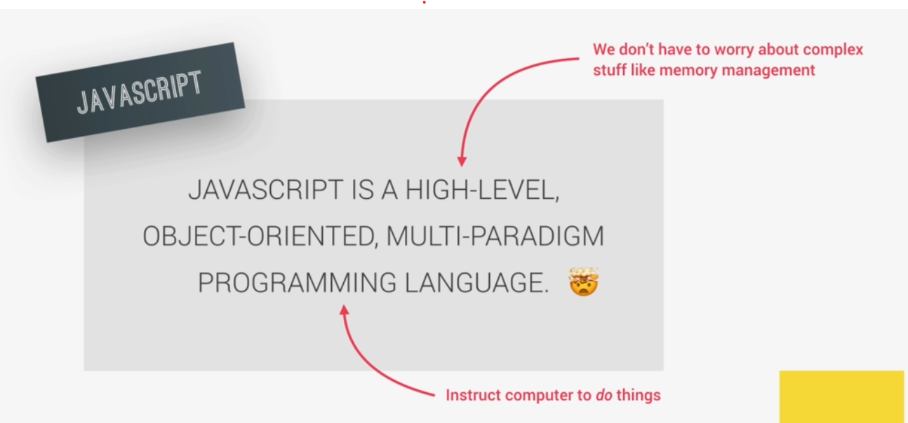

# Lộ trình học JS
## 1 . JavaScript Fundamentals
- Bắt đầu với Helloworld :
  - Cách bật console trên trình duyệt để thao tác lệnh js trực tiếp
  - Alert("Hello world"");
- Giới thiệu qua về JS (HTML, CSS để hiển thị, còn JS giúp web có các chức năng, sự kiện ...)
  - Các open source framework Vue, Angular, React (Typescript) cuối cùng đều dịch ra javascript
  - Chính là phần mà người ta hay nó là **front end** - để kết hợp với backend
> 
- Linking a JavaScript File :
  - Nhúng js vào file HTML (internal)
  - Js External (để 1 file js riêng)
- Values and Variables :
  - variable names in JavaScript in camelCase
- Data Types :
  - Nguyên thủy :
      - Number
      - String
      - Boolean
      - Undefine
      - Null
  - Không nguyên thủy :
      - Object
      - Array :
        - Mảng trong mảng
        - Truy cập theo index
        - Mảng 2 chiều
        - Một số hàm : push(), pop(), shift(), unshift()
      - RegExp
- let, const and var :
  - Global scope and function scope
- Basic Operators :
  - Phép tính cộng, trừ, nhân, chia
  - Một số hàm hay dùng :
    - Math.random()
- Operator Precedence
- Strings and Template Literals
- Logical :
  - Taking Decisions if  else Statements
  - Type Conversion and Coercion
  - Truthy and Falsy Values
  - Equality Operators == vs. ===
  - Boolean Logic
  - Logical Operators
  - The switch Statement
  - Statements and Expressions
  - The Conditional (Ternary) Operator
## 2 . JavaScript Fundamentals 2
- Functions
- Function Declarations vs. Expressions
- Arrow Functions
- Functions Calling Other Functions
- Introduction to Objects
- Dot vs. Bracket Notation
- Object Methods
- Loop :
  - Loop
  - While loop
  - Looping Arrays, Breaking and Continuing
  - Looping Backwards and Loops in Loops
